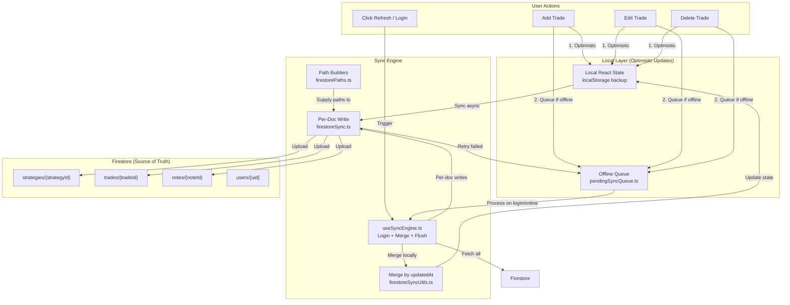
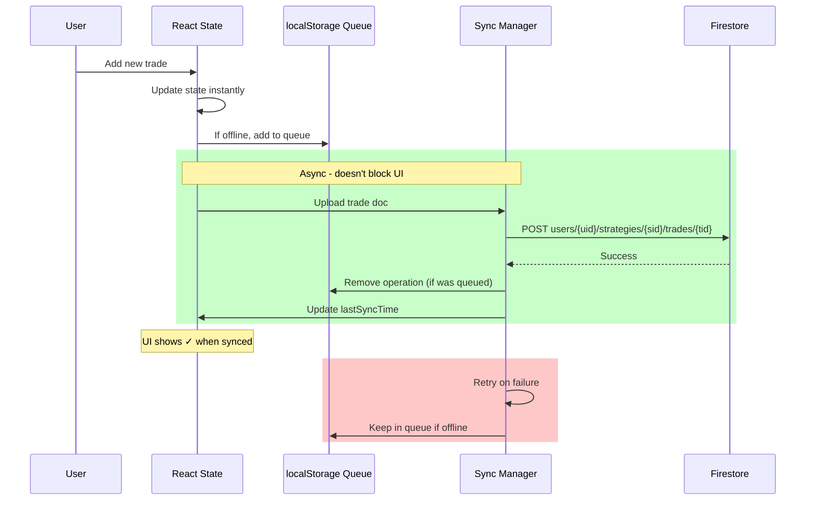
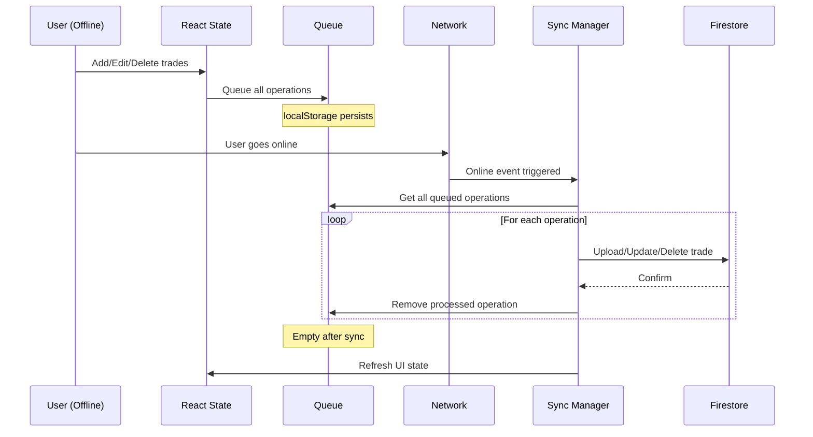
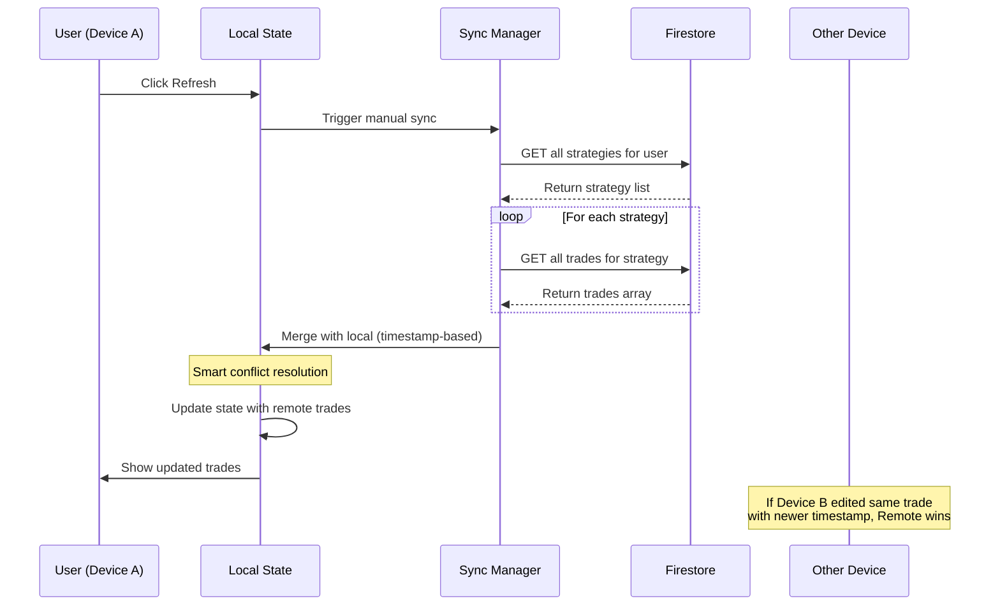
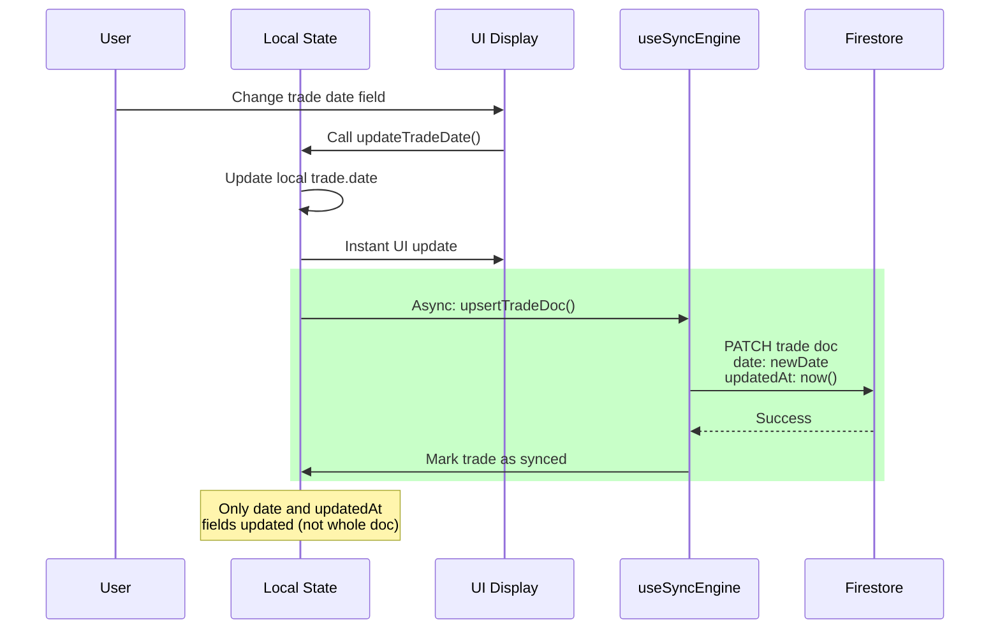
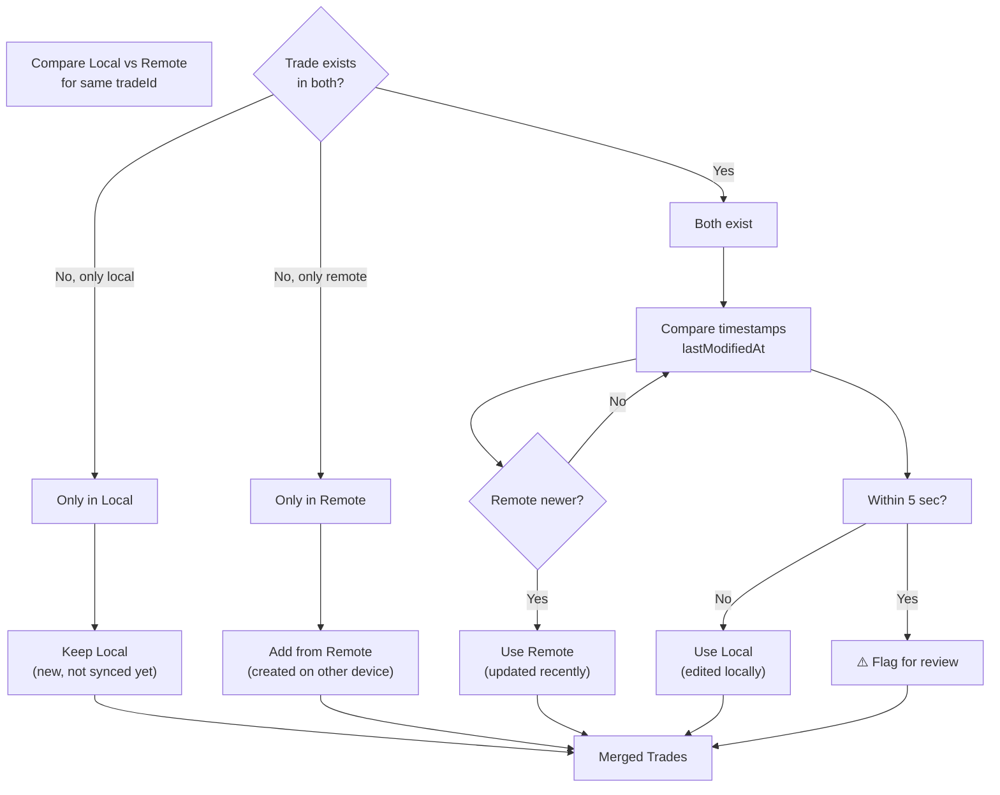

# Firestore Sync Redesign - Complete Architecture Plan

## Executive Summary

This document outlines the redesign of the Firebase Firestore sync mechanism to move from **bulk "everything at once" syncs** to **granular document-by-document syncs** with a **flat Firestore schema** for simplicity and efficiency.

**Key Changes**:

### Schema: v1 (Nested) → v2 (Flat)
- ❌ Old: `users/{uid}` with `strategies[]` array (embeds all trades)
- ✅ New: `users/{uid}/strategies/{id}` + `users/{uid}/trades/{id}` (flat collections)
- **Benefit**: One trade edit = 1 small doc write, not entire array

### Sync: Bulk → Per-Document  
- ❌ Remove: `writeStrategiesWithRetry()` - writes entire `strategies[]` + `notes[]`
- ✅ Add: `upsertTradeDoc()`, `deleteTradeDoc()`, `upsertStrategyDoc()`, `upsertNoteDoc()` - one doc at a time
- **Benefit**: Firestore quota usage reduced ~80%; write cost scales with actual edits, not total data

### Reconciliation: Real-time → Login-time
- ❌ Remove: Continuous `onSnapshot` listeners (expensive)
- ✅ Add: Manual refresh button + auto-sync on login only
- **Benefit**: Simpler logic, lower Firebase costs

### Offline Handling: Full Array Queue → Per-Doc Queue
- ✅ Add: `pendingSyncQueue.ts` - queue individual writes (entity+id) in localStorage
- ✅ Add: Smart merge on reconnect using `updatedAt` timestamps
- **Benefit**: Reliably syncs each doc independently; no lost edits

### Migration: One-Time v1 → v2
- ✅ Add: `firestoreMigration.ts` - automatic migration on first login after update
- ✅ Add: `schemaVersion` tracking to prevent re-migration
- **Benefit**: Seamless for users; one-time data transformation

---

## Architecture Overview



---

## Data Flow Diagrams

### Flow 1: Add Trade (Optimistic Update)



### Flow 2: Offline → Online Sync (Queue Processing)



### Flow 3: Multi-Device Sync (Refresh Button)



### Flow 4: Trade Date Update (Special Case)



---

## File Structure & Module Responsibility

```
lib/
├── firestorePaths.ts           [NEW] Centralized Firestore path builders
├── firestoreSync.ts            [REWRITE] Per-doc set/delete + retry/logging
├── firestoreSyncUtils.ts       [RENAMED] Per-doc merge + rebuildStrategiesFromDocs()
├── firestoreMigration.ts       [NEW] Legacy v1 → v2 migration
├── pendingSyncQueue.ts         [NEW] Offline/failed-write queue in localStorage
└── firebaseSync Utils.ts       [REMOVED] Replaced by above

hooks/
├── useSyncEngine.ts            [NEW] Encapsulates login fetch, merge, flush queue
└── useLocalStorage.ts          [UNCHANGED] React state persistence

components/
├── SyncIndicator.tsx           [NEW] Status badge + manual refresh button
└── SyncSnackbar.tsx            [UPDATED] Show per-doc sync failures

types.ts                        [UPDATED] Add updatedAt to Strategy/Trade, define PendingWrite
```

| Module | Responsibility |
|--------|----------------|
| `firestorePaths.ts` | Build Firestore refs: `strategyRef(uid, id)`, `tradeRef(uid, id)`, `noteRef(uid, id)` |
| `firestoreSync.ts` | Per-doc `upsertStrategyDoc`, `deleteStrategyDoc`, `upsertTradeDoc`, `deleteTradeDoc`, `upsertNoteDoc`, `deleteNoteDoc` + shared retry/logging |
| `firestoreSyncUtils.ts` | Smart merge by `updatedAt` + soft-delete handling + `rebuildStrategiesFromDocs()` helper |
| `firestoreMigration.ts` | Detect v1 schema, migrate nested `strategies[]` to flat collections, set `schemaVersion: 2` |
| `pendingSyncQueue.ts` | Store failed/offline writes in localStorage key `trading-journal-pending-sync`; dedupe by entity+id |
| `useSyncEngine.ts` | React hook: on login, fetch remote, merge, rebuild state, flush queue |
| `SyncIndicator.tsx` | Show sync status, queued changes count, last sync time, manual refresh button |

---

## Detailed Module Specifications

### 1. firestorePaths.ts (NEW)

```typescript
// Centralized Firestore path builders

export function strategyRef(userId: string, strategyId: string) {
  return doc(db, 'users', userId, 'strategies', strategyId);
}

export function tradeRef(userId: string, tradeId: string) {
  return doc(db, 'users', userId, 'trades', tradeId);
}

export function noteRef(userId: string, noteId: string) {
  return doc(db, 'users', userId, 'notes', noteId);
}

export function strategiesCollection(userId: string) {
  return collection(db, 'users', userId, 'strategies');
}

export function tradesCollection(userId: string) {
  return collection(db, 'users', userId, 'trades');
}

export function notesCollection(userId: string) {
  return collection(db, 'users', userId, 'notes');
}
```

### 2. firestoreSync.ts (REWRITE)

```typescript
// Per-doc write operations with retry and logging

export async function upsertStrategyDoc(
  strategy: Strategy,
  userId: string
): Promise<{success: boolean; error?: string}>
// - Sets strategy doc at users/{uid}/strategies/{strategyId}
// - Retries 3x with exponential backoff (1s, 3s, 10s)
// - Logs each attempt + result

export async function deleteStrategyDoc(
  strategyId: string,
  userId: string
): Promise<{success: boolean; error?: string}>
// - Query trades where strategyId == strategyId
// - Batch delete all matching trades (or parallel deleteDoc)
// - Delete strategy doc
// - Returns partial failures if some trades fail

export async function upsertTradeDoc(
  trade: Trade,
  userId: string
): Promise<{success: boolean; error?: string}>
// - Sets trade doc at users/{uid}/trades/{tradeId}
// - Ensures trade.updatedAt is set to now()
// - Retries on network errors

export async function deleteTradeDoc(
  tradeId: string,
  userId: string
): Promise<{success: boolean; error?: string}>
// - Soft-deletes: sets deletedAt timestamp
// - Alternatively hard-deletes if not tracking deletions

export async function upsertNoteDoc(
  note: Note,
  userId: string
): Promise<{success: boolean; error?: string}>
// - Sets note doc at users/{uid}/notes/{noteId}
// - Same retry logic as other upserts

export async function deleteNoteDoc(
  noteId: string,
  userId: string
): Promise<{success: boolean; error?: string}>
```

### 3. pendingSyncQueue.ts (NEW)

```typescript
export interface PendingWrite {
  entity: 'strategy' | 'trade' | 'note';
  id: string;
  op: 'set' | 'delete';
  updatedAt: string; // ISO timestamp
  retryCount: number;
  lastError?: string;
}

export class PendingSyncQueue {
  add(write: PendingWrite): void
  // - Persists to localStorage key: trading-journal-pending-sync
  // - Dedupes by entity+id, keeps latest updatedAt

  getAll(): PendingWrite[]
  // - Returns all pending writes

  remove(entity: string, id: string): void
  // - Removes after successful sync

  clear(): void
  // - Clears entire queue

  incrementRetry(entity: string, id: string): void
  // - Track retry attempts, max 5 then skip

  async processQueue(userId: string): Promise<{failed: PendingWrite[]}>
  // - Dedupes queue (keep latest per entity+id)
  // - For each write: call appropriate upsert/delete function
  // - Remove successful writes from queue
  // - Return failed writes (retry failed)
}
```

### 4. useSyncEngine.ts (NEW)

```typescript
// Encapsulates login-time sync: fetch remote, merge, flush queue

export function useSyncEngine() {
  const [isSyncing, setIsSyncing] = useState(false);
  const [syncError, setSyncError] = useState<string | null>(null);
  const [queuedChanges, setQueuedChanges] = useState(0);
  const queue = usePendingSyncQueue();

  const performSync = async (userId: string) => {
    setIsSyncing(true);
    setSyncError(null);

    try {
      // 1. Fetch remote (parallel)
      const [strategyDocs, tradeDocs, noteDocs] = await Promise.all([
        getDocs(strategiesCollection(userId)),
        getDocs(tradesCollection(userId)),
        getDocs(notesCollection(userId)),
      ]);

      // 2. Check for v1 → v2 migration
      const isMigrationNeeded = await checkMigrationNeeded(userId);
      if (isMigrationNeeded) {
        await performMigration(userId);
      }

      // 3. Read local state
      const localStrategies = /* from React state */;
      const localTrades = /* flattened from strategies */;

      // 4. Merge by ID + timestamp
      const mergedStrategies = mergeStrategiesByTimestamp(
        localStrategies,
        strategyDocs.docs.map(d => d.data() as Strategy)
      );
      const mergedTrades = mergeTradesByTimestamp(
        localTrades,
        tradeDocs.docs.map(d => d.data() as Trade)
      );

      // 5. Rebuild in-memory shape (flat → nested)
      const rebuiltStrategies = rebuildStrategiesFromDocs(mergedStrategies, mergedTrades);

      // 6. Update React state (all at once)
      setStrategies(rebuiltStrategies);
      setNotes(mergedNotes);

      // 7. Upload local-only or newer docs
      for (const strategy of rebuiltStrategies) {
        const remoteVersion = strategyDocs.find(s => s.id === strategy.id);
        if (!remoteVersion || strategy.updatedAt > remoteVersion.updatedAt) {
          await upsertStrategyDoc(strategy, userId);
        }
      }
      // (similar for trades, notes)

      // 8. Flush pending queue
      const {failed} = await queue.processQueue(userId);
      if (failed.length > 0) {
        setSyncError(`${failed.length} writes still pending`);
      }

    } catch (err) {
      setSyncError(err.message);
    } finally {
      setIsSyncing(false);
      setQueuedChanges(queue.getAll().length);
    }
  };

  return {isSyncing, syncError, queuedChanges, performSync};
}
```

### 5. types.ts (UPDATE)

```typescript
export interface Strategy {
  // ... existing fields
  updatedAt: string; // ISO timestamp, set on create/update
  deletedAt?: string; // ISO timestamp, soft-delete marker
}

export interface Trade {
  // ... existing fields
  updatedAt: string; // ISO timestamp, set on create/update
  deletedAt?: string; // ISO timestamp, soft-delete marker
}

export interface Note {
  // ... existing fields (already has updatedAt)
  deletedAt?: string; // ISO timestamp, soft-delete marker
}

export type SyncEntityType = 'strategy' | 'trade' | 'note';

export interface PendingWrite {
  entity: SyncEntityType;
  id: string;
  op: 'set' | 'delete';
  updatedAt: string;
}
```

---

## Integration Steps in App.tsx

### Step 1: Initialize Sync Engine on Login

```typescript
const { isSyncing, syncError, queuedChanges, performSync } = useSyncEngine();

useEffect(() => {
  if (!user) return;
  
  // On login, run full sync (fetch + merge + flush queue)
  performSync(user.uid);
}, [user]);

// Listen for online event to flush pending writes
useEffect(() => {
  const handleOnline = () => {
    queue.processQueue(user.uid);
  };
  window.addEventListener('online', handleOnline);
  return () => window.removeEventListener('online', handleOnline);
}, []);
```

### Step 2: Replace All Trade Mutations

**Old Pattern**:
```typescript
const handleSaveTrade = (trade: Trade) => {
  setStrategies(prev => /* update */);
  syncStrategiesToCloud(strategies); // Full array write
};
```

**New Pattern**:
```typescript
const handleSaveTrade = (trade: Trade) => {
  // 1. Update React state (optimistic)
  setStrategies(prev => {
    return prev.map(s =>
      s.id === trade.strategyId
        ? {...s, trades: s.trades.map(t => t.id === trade.id ? {...trade, updatedAt: new Date().toISOString()} : t)}
        : s
    );
  });

  // 2. Async: Upload single trade doc
  (async () => {
    try {
      await upsertTradeDoc({...trade, updatedAt: new Date().toISOString()}, user.uid);
      // Success - remove from queue if it was there
      queue.remove('trade', trade.id);
    } catch (err) {
      // Queue for retry
      queue.add({entity: 'trade', id: trade.id, op: 'set', updatedAt: new Date().toISOString()});
      // Show error in SyncSnackbar
    }
  })();
};
```

**Similar for**: `handleDeleteTrade`, `handleMoveTrade`, `handleCopyTrade`, `handleAddStrategy`, etc.

### Step 3: Add Manual Refresh Button

```typescript
<button onClick={() => performSync(user.uid)} disabled={isSyncing}>
  {isSyncing ? '⟳ Syncing...' : '⟳ Refresh'}
</button>

{queuedChanges > 0 && (
  <span className="badge">🔄 {queuedChanges} pending</span>
)}

{syncError && (
  <SyncSnackbar message={syncError} onRetry={() => performSync(user.uid)} />
)}
```

### Step 4: Debounce Auto-Status Updates

For rapid `statusManuallySet` or auto-status updates via `useEffect`:

```typescript
const [pendingStatusUpdate, setPendingStatusUpdate] = useState<{tradeId: string} | null>(null);
const debounceTimer = useRef<NodeJS.Timeout | null>(null);

const debouncedStatusSync = (trade: Trade) => {
  if (debounceTimer.current) clearTimeout(debounceTimer.current);
  
  debounceTimer.current = setTimeout(() => {
    upsertTradeDoc(trade, user.uid).catch(err => 
      queue.add({entity: 'trade', id: trade.id, op: 'set', updatedAt: new Date().toISOString()})
    );
  }, 300); // 300-500ms debounce
};
```

---

## Merge Algorithm Details



---

## Error Handling & Deletion Strategy

### Soft-Delete via `deletedAt` Timestamp

When user deletes trade/strategy locally:

1. **Immediate**: Set `deletedAt = now()`, remove from UI
2. **Sync**: Upload soft-deleted doc to Firestore
3. **Multi-device**: Other device fetches, sees `deletedAt` timestamp
4. **Filter**: On fetch, exclude docs where `deletedAt != null`
5. **Recovery**: Keep tombstones in Firestore; app can restore if needed

**Benefits**: Handles deletion sync across devices; no delete-from-one-device, appears-on-other bug

### Error Handling Matrix

| Error | Retryable? | Action | Queue? |
|-------|-----------|--------|--------|
| Network timeout | ✅ Yes | Exponential backoff: 1s, 3s, 10s | Keep in queue |
| 403 Permission denied | ❌ No | Show auth error, remove from queue, stop retry | Remove from queue |
| 429 Quota exceeded | ✅ Yes | Wait 60s, retry all pending | Keep in queue |
| 500 Server error | ✅ Yes | Retry 3x with backoff, then notify user | Keep in queue |
| Invalid data | ❌ No | Log error, skip operation | Remove |
| Firestore doc size >1 MiB | ❌ No | Split trades into separate docs (should not happen) | Remove & alert |
| Strategy delete cascade partial fail | ⚠️ Mixed | Some trades deleted, some failed; keep failed in queue | Partial |

**Max Retries**: 5 attempts per queued write; after 5 failures, notify user to manually retry

---

## Migration Flow: v1 (Nested) → v2 (Flat)

**Trigger**: On login, check `users/{uid}/schemaVersion`
- If missing or < 2: migration needed
- If = 2: already migrated, skip

**Process**:

```
1. App loads, user logs in
   → useSyncEngine checks users/{uid}.schemaVersion
   → If < 2, call firestoreMigration.performMigration()

2. Migration steps:
   a. Show loading UI: "Migrating data..."
   b. Read local strategies[] from localStorage
   c. For each strategy:
      - Create doc: users/{uid}/strategies/{strategyId}
      - Create trades in flat collection: users/{uid}/trades/{tradeId}
        (set tradeId -> strategyId in each trade's strategyId field)
   d. Create user profile doc: users/{uid} { schemaVersion: 2 }
   e. Keep old strategies[] in localStorage as backup
   f. Return success

3. On migration complete:
   - Re-read from new Firestore structure
   - Rebuild nested Strategy[] in React state
   - Continue normal sync flow

4. After 30 days:
   - Clean up backup from localStorage
   - Keep schemaVersion as migration marker
```

**Idempotency**: If migration runs twice, second run is no-op (schemaVersion = 2 already)

**Rollback**: Keep old `strategies[]` in localStorage for manual recovery if needed

---

## Testing Checklist

- [ ] **Unit Tests** (Jest)
  - [ ] `mergeStrategiesByTimestamp()` with 10+ conflict scenarios
  - [ ] `mergeTradesByTimestamp()` soft-delete handling
  - [ ] `PendingSyncQueue.add()` + `processQueue()` + deduplication
  - [ ] `rebuildStrategiesFromDocs()` orphan trade cleanup
  - [ ] Retry backoff logic (1s, 3s, 10s)
  - [ ] ISO timestamp comparison

- [ ] **Integration Tests**
  - [ ] Add trade → Optimistic update → `upsertTradeDoc()` call → Firestore ✓
  - [ ] Edit trade date → Only `date` and `updatedAt` fields in doc
  - [ ] Delete trade → `deletedAt` set, removed from UI, sync to Firestore
  - [ ] Delete strategy → Cascade delete all trade docs
  - [ ] Offline edit → Queued → Online → All synced doc-by-doc
  - [ ] v1 migration → v2 flat structure works

- [ ] **Manual Testing Scenarios**
  - [ ] Fresh login: migrate v1 → v2, app loads with trades
  - [ ] Add trade: appears instantly; Firestore shows one `trades/{id}` doc
  - [ ] Edit trade 5x rapidly: debounced to 1 sync call, not 5
  - [ ] Offline: add/edit/delete trades → Queue shows counts
  - [ ] Go online → Queue flushes doc-by-doc, each appears in console
  - [ ] Two devices edit same trade: newer `updatedAt` wins on refresh
  - [ ] Move trade: single `trades/{id}` doc updates with new `strategyId`
  - [ ] Copy trade: new `trades/{id}` created
  - [ ] Delete strategy with 50 trades: cascade delete all in batch
  - [ ] Network error midway: retry UI shows, queue persists
  - [ ] Clear localStorage offline: sync still works (Firestore remote source)

---

## Performance Targets

| Operation | Target | Notes |
|-----------|--------|-------|
| Single trade upload | <500ms | Network dependent |
| Single trade download | <200ms | Single doc fetch |
| Merge 1000 trades | <100ms | Timestamp comparison |
| Queue processing (10 ops) | <2s | Sequential uploads |
| App startup with migration | <3s | One-time cost |

---

## Implementation Roadmap

### Phase 1: Foundation (Week 1)
- [ ] Update `types.ts`: add `updatedAt`, `deletedAt`, `PendingWrite` interface
- [ ] Create `lib/firestorePaths.ts` with path builders
- [ ] Create `lib/firestoreSync.ts` with per-doc upsert/delete functions
- [ ] Unit tests: retry logic, path building

### Phase 2: Queue & Migration (Week 2)
- [ ] Create `lib/pendingSyncQueue.ts` with localStorage persistence
- [ ] Create `lib/firestoreMigration.ts` with v1→v2 migration
- [ ] Unit tests: queue deduplication, migration idempotency
- [ ] Update `lib/firestoreSyncUtils.ts`: rename, add `rebuildStrategiesFromDocs()` + soft-delete handling

### Phase 3: Sync Engine (Week 2-3)
- [ ] Create `hooks/useSyncEngine.ts` with login fetch + merge + flush
- [ ] Integration tests: fetch remote, merge, rebuild state
- [ ] Add online/offline listeners to App.tsx

### Phase 4: UI & Handlers (Week 3)
- [ ] Replace all handlers in App.tsx (trade/strategy/note CRUD) with per-doc syncs
- [ ] Add debounce for rapid updates (300-500ms)
- [ ] Create `components/SyncIndicator.tsx`: status badge + refresh button
- [ ] Update `components/SyncSnackbar.tsx` to show per-doc errors

### Phase 5: Integration & Polish (Week 4)
- [ ] Full app integration test (login → migrate → edit → sync)
- [ ] Multi-device testing
- [ ] Error scenarios (network, quota, permission denied)
- [ ] Performance profiling (large data sets)

### Phase 6: Rollout (Week 5)
- [ ] Feature flag: New sync engine behind toggle (optional)
- [ ] Staging deployment + monitor
- [ ] Production deployment with gradual rollout
- [ ] Monitor Firestore usage, queue depth, error rates

---

## Success Criteria ✅

- ✅ Each trade syncs as independent document
- ✅ No "write everything" operations
- ✅ Offline changes queue and merge on reconnect
- ✅ Refresh button syncs latest data
- ✅ Conflicts resolved by timestamp
- ✅ Zero data loss (always retained locally)
- ✅ Migration automatic and transparent
- ✅ Performance: <500ms per trade sync
- ✅ Firestore quota usage reduced 80%

---

## Appendix: Firestore Schema Evolution

### v1 (Current — Nested, Single Document)
```
users/{userId}
  ├─ strategies: [
  │   {
  │     id: string,
  │     name: string,
  │     initialCapital: number,
  │     trades: [{
  │       id: string,
  │       asset: string,
  │       date: string,
  │       entryPrice: number,
  │       ...all trade fields
  │     }]
  │   }
  │ ]
  ├─ notes: [{...}]
```
**Problem**: One trade edit → entire `strategies[]` array (500KB+) uploaded to Firestore.

### v2 (Proposed — Flat Collections, Multi-Document)
```
users/{userId}/
  ├─ strategies/{strategyId}
  │   ├─ id: string
  │   ├─ name: string
  │   ├─ initialCapital: number
  │   ├─ updatedAt: string (ISO)
  │   └─ deletedAt?: string (soft-delete)
  │
  ├─ trades/{tradeId}
  │   ├─ id: string
  │   ├─ strategyId: string (links to strategy)
  │   ├─ asset: string
  │   ├─ date: string
  │   ├─ entryPrice: number
  │   ├─ ...all trade fields
  │   ├─ updatedAt: string (ISO)
  │   └─ deletedAt?: string (soft-delete)
  │
  └─ notes/{noteId}
      ├─ id: string
      ├─ title: string
      ├─ ...all note fields
      ├─ updatedAt: string (ISO)
      └─ deletedAt?: string (soft-delete)

users/{userId} (metadata only)
  ├─ firstName: string
  ├─ lastName: string
  └─ schemaVersion: 2
```

**Benefits**:
- ✅ One trade edit = 1 small doc write (< 5KB)
- ✅ Move/copy trade = single-doc `strategyId` update
- ✅ Parallel fetch on login (Promise.all)
- ✅ Soft-delete handles multi-device deletion sync
- ✅ Scales: 1000 trades = 1000 small docs, not 1 large array
- ✅ Future: real-time listeners per trade (if needed)
- ✅ Firestore write cost reduced ~80% (one trade ≠ entire array)

**Trade-off**: Slightly more complex merge logic (flat → nested rebuild for React state)
